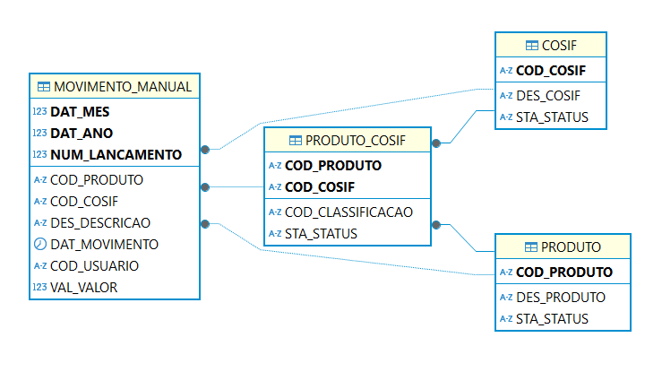
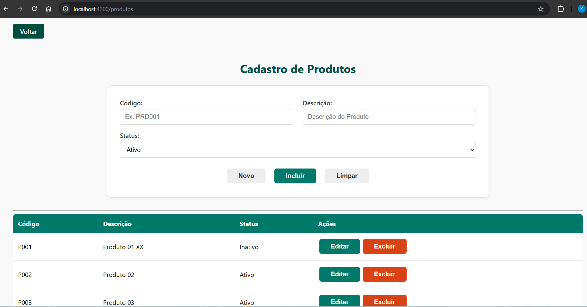
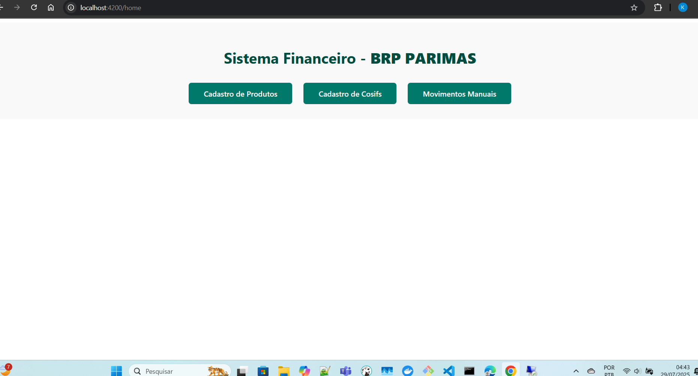
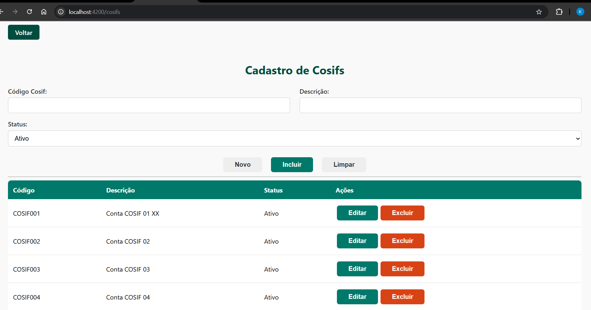
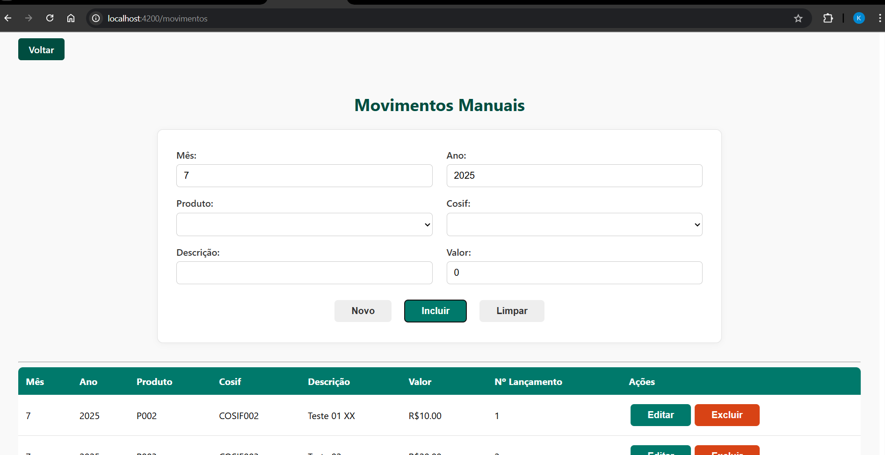

# 💼 Projeto MVP - Sistema de Movimentos Manuais (BRP PARIMAS)

## 📚 Visão Geral

Este projeto é um **MVP (Produto Mínimo Viável)** desenvolvido para gerenciar **Movimentos Manuais Contábeis**, com foco na escalabilidade, separação de responsabilidades e clareza entre as camadas da aplicação.

O sistema é composto por:

- 🖥️ **Frontend Angular (SPA)** – Interface do usuário
- ⚙️ **Backend ASP.NET Core** – Lógica de negócios e API RESTful
- 🗃️ **SQL Server** – Armazenamento relacional de dados

---

## 🧱 Arquitetura em Camadas

O projeto é modularizado e dividido nas seguintes camadas:

### 🔸 1. Apresentação (Frontend)

**Tecnologia:** Angular 17+

**Responsabilidade:**  
Fornecer uma interface gráfica (UI) responsiva e moderna para interação com o usuário.

**Pastas:**

- `/home/` → Tela inicial com navegação
- `/produtos/` → CRUD de produtos
- `/cosifs/` → CRUD de cosifs (produto-cosif)
- `/movimentos/` → Lançamento de movimentos manuais

**Principais recursos:**

- Data-binding via `[(ngModel)]`
- Serviços HTTP para consumo da API REST
- Validações de formulário
- Navegação via `routerLink`
- Estilização com SCSS customizado

---

### 🔸 2. Aplicação (Backend API)

**Tecnologia:** ASP.NET Core 7+

**Responsabilidade:**  
Expor endpoints RESTful e conter a lógica de negócio.

**Pastas:**

- `/Controllers/` → Acesso às rotas e endpoints
  - `ProdutosController.cs`
  - `CosifsController.cs`
  - `MovimentosController.cs`
- `/Services/` → Regras de negócio
  - `ProdutoService.cs`
  - `CosifService.cs`
  - `MovimentoService.cs`
- `/DTOs/` (opcional) → Objetos de transporte de dados entre API e UI

---

### 🔸 3. Domínio (Entidades e Modelos)

**Responsabilidade:**  
Representar os modelos de dados e suas regras intrínsecas.

**Pastas:**

- `/Models/`
  - `Produto.cs`
  - `ProdutoCosif.cs`
  - `MovimentoManual.cs`

**Observações:**

- Utiliza `DataAnnotations` para validações
- Define chaves primárias, relacionamentos e constraints

---

### 🔸 4. Infraestrutura (Banco de Dados e Migrations)

**Tecnologia:** SQL Server + EF Core

**Responsabilidade:**  
Gerenciar o armazenamento persistente dos dados.

**Pastas:**

- `/Data/` → `DbContext`, configurações EF Core, Migrations

**Features:**

- `DbSet<T>` para cada entidade
- Scripts de migração via `dotnet ef`
- Strings de conexão definidas no `appsettings.json`

---

## 🚀 Execução do Projeto

### 🧪 Pré-requisitos

- Node.js >= 18.x
- Angular CLI >= 17.x
- .NET SDK >= 7.x
- SQL Server 2019+
- Docker (opcional)

---

## 🔧 Backend - Local

```bash
# 1. Configurar appsettings.json
"ConnectionStrings": {
  "DefaultConnection": "Server=localhost;Database=MovimentosDB;User Id=sa;Password=senha123;"
}

# 2. Aplicar migrations
dotnet ef migrations add InitialCreate
dotnet ef database update

# 3. Executar API
dotnet run
````

API disponível em: [http://localhost:5000/api](http://localhost:5000/api)

---

## 🐳 Backend - Docker

```bash
# Dockerfile (exemplo)
FROM mcr.microsoft.com/dotnet/aspnet:7.0 AS base
WORKDIR /app
EXPOSE 80

FROM mcr.microsoft.com/dotnet/sdk:7.0 AS build
WORKDIR /src
COPY . .
RUN dotnet restore
RUN dotnet publish -c Release -o /app/publish

FROM base AS final
WORKDIR /app
COPY --from=build /app/publish .
ENTRYPOINT ["dotnet", "MovimentosManual.Api.dll"]
````

```bash
docker build -t movimentos-backend .
docker run -d -p 5000:80 movimentos-backend
````

---

## 🌐 Frontend - Angular

```bash
npm install
ng serve --open
````

Acesse: [http://localhost:4200](http://localhost:4200)

---

## 🎨 Estilo Visual

* Paleta principal: **#006341** (Verde BNP)
* Layout centralizado e responsivo
* Botões primários, neutros e de exclusão
* Marca d´água BRP PARIMAS no topo
* CSS modularizado com `SCSS` por componente

---

## 🔄 Funcionalidades

### Produtos

* Cadastro, edição e exclusão
* Listagem com filtros e validação

### Cosifs (ProdutoCosif)

* Relacionamento com Produto
* CRUD completo e validação

### Movimentos Manuais

* Seleção de produto e cosif dinâmico
* Lançamentos com valores e data
* Listagem tabular com ações

---

## 🔍 API & Swagger

* Todas as rotas expostas no padrão RESTful
* Documentação interativa em:
  [http://localhost:5000/](http://localhost:5000/)

---

## 🧪 Boas Práticas

* Componentização Angular por domínio
* SCSS isolado por componente
* Services desacoplados (Angular + .NET)
* Uso de interfaces e tipagens explícitas
* Separação clara entre camadas (MVC)
* Validações tanto no client quanto no server

---

## 🤝 Contribuições

Contribuições, correções ou melhorias são bem-vindas!

1. Faça um fork do projeto
2. Crie sua branch: `git checkout -b feature/sua-feature`
3. Commit: `git commit -m 'feat: nova funcionalidade'`
4. Push: `git push origin feature/sua-feature`
5. Abra um Pull Request

---

## 📬 Contato

* 📧 Email: [kleber.ime.usp@gmail.com](mailto:kleber.ime.usp@gmail.com)
* 🔗 LinkedIn: [Kleber Augusto](https://www.linkedin.com/in/kleber-augusto/)

---

## ✅ Status do Projeto

* ✅ MVP entregue e funcional
* 🔧 Aberto para melhorias e refatorações

---

### 1. Modelo Database


---

### 2. Swagger


---

### 3. Menu


---

### 4. Cadastro de Produtos


---

### 5. Cadastro de Cosifs


---

### 6.Cadastro de Movimento Manual


---

> *Desenvolvido com 💚 por um estrategista fullstack comprometido com escalabilidade, boas práticas e código limpo.*


